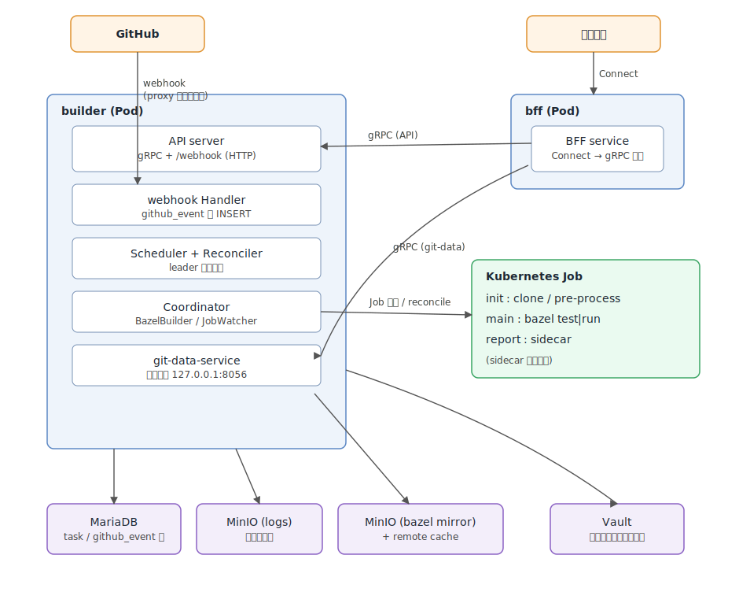

# Build

自作のCIツール。Bazelの `test` / `run` を Kubernetes Job として実行するためのシステム。GitHub の Webhook
や手動操作をトリガーにビルドを起動し、ログ・テスト結果を保存して Web ダッシュボードで閲覧できる。

このドキュメントは `go/build`（バックエンド）、`ts/apps/build`（フロントエンド）、`proto/build`（スキーマ）の
3 つを横断してアーキテクチャを記述する。

## 全体像

主要なバイナリは 2 つ。

- **builder** (`go/build/cmd/builder`): 中核プロセス。API サーバー、Webhook 受信、ビルドのコーディネート、
  各種ワーカー、（任意で）git-data-service を 1 プロセス内で起動する。複数レプリカで動かし、
  リーダー選出で実際にビルドを駆動するワーカーを 1 つに絞る。
- **bff** (`go/build/cmd/bff`): ブラウザ向けの Backend For Frontend。Connect プロトコルを話し、内部では
  builder の gRPC API と git-data-service を呼び出す。

補助バイナリとして **buildctl**（CLI クライアント）、**sidecar**（Job 内で clone / 認証 / レポート生成を行う）がある。

## バックエンド (`go/build`)

### パッケージ構成

| パッケージ                      | 役割                                                                     |
|----------------------------|------------------------------------------------------------------------|
| `cmd/builder`              | builder バイナリのエントリポイント。FSM で各サブシステムを起動・配線する。                            |
| `cmd/bff`                  | bff バイナリのエントリポイント。                                                     |
| `cmd/buildctl`             | CLI クライアント（tasks / jobs / repositories / test サブコマンド）。                 |
| `cmd/sidecar`              | Job 内で動く補助コマンド（clone, credential, report）。                             |
| `api`                      | builder が公開する gRPC API サーバー (`API` サービス) と Webhook の HTTP エンドポイント。     |
| `bff`                      | ブラウザ向け Connect サービス (`BFF`)。API と git-data-service を集約する。              |
| `coordinator`              | `BazelBuilder`。Task を Kubernetes Job に変換し、ライフサイクルを reconcile する中核。     |
| `coordinator/job.go` (`JobBuilder`) | Job マニフェスト（init/main/report コンテナ、Secret 等）を組み立てる。                      |
| `webhook`                  | Webhook の受信 (`Handler`)、`Scheduler`、イベント種別ごとの `Reconciler`、`Notifier`。 |
| `watcher`                  | Kubernetes の Job informer。`jobType` ごとの reconcile 関数にイベントをルーティングする。    |
| `releasewatcher`           | サードパーティのリリース/タグをポーリングし `external_release` トリガーを発火する。                   |
| `gc`                       | 古い Job / ログのガベージコレクション。                                                |
| `config`                   | ジョブ設定の読み込み。Starlark の `Job`(旧) と CUE の `JobV2`(現行)。                    |
| `database`, `database/dao` | スキーマ定義（protoc-ddl 生成）と DAO。                                            |
| `model`                    | API/BFF/DB 間で共有するドメインの protobuf メッセージ。                                 |

### builder の起動シーケンス (FSM)

`cmd/builder/main.go` はステートマシンとして動作する。状態遷移は次の通り。

1. `init`: GitHub クライアント、kube-apiserver クライアント（`--dev` 時はスキップ）、MariaDB 接続
   (`querylog` ドライバ経由)、Vault クライアント、MinIO 認証情報を準備。
2. `checkMigrate`: `protoc-ddl/probe` で DB スキーマが `database.SchemaHash` と一致するまで最大 5 分待つ。
   マイグレーション自体は builder ではなく、別途実行される `migrate` Job（`build` イメージの `migrate`
   サブコマンド、`--schema=/schema/schema.sql --driver=mysql --execute`）が行う。builder はそれの完了を待つだけ。
3. `setup`: MinIO（ログ用 / Bazel ミラー用）と Kubernetes のオプションを構築し、`coordinator.BazelBuilder` を生成。
4. `startGitDataService`: `--git-data-listen` 指定時のみ。埋め込みの git-data-service (gRPC) と `git.Updater` を起動する。
5. `startApiServer`: `Notifier`・`Reconcilers` を組み立て、`api.NewApi` で HTTP/gRPC サーバーを起動。
6. `leaderElection`: `--enable-leader-election` 時に Lease ロックを取得。リーダーになるまでブロックする。
7. `startWorker`: リーダーのみ：JobWatcher、（任意で）GC、releasewatcher の Manager、webhook Scheduler、
   git-data の定期更新を goroutine で起動。
8. `shutdown`: API サーバー / git-data gRPC サーバーを graceful stop。

ポイントは **API サーバーと Webhook 受信は全レプリカで動く**が、**実際にビルドを駆動するワーカー
（Scheduler / JobWatcher など）はリーダーのみ**で動くこと。非リーダーの Webhook Handler は行を INSERT して
リーダーのポーリングに任せる。

### API サーバー (`api` パッケージ)

`api.Api` は 1 つの `http.Server` で以下を多重化する。

- `Content-Type: application/grpc` の HTTP/2 リクエスト → gRPC `API` サービス (`apiService`)。
- それ以外 → `/webhook`（`webhook.Handler`）、`/liveness`、`/readiness` 等の HTTP ハンドラ。

`apiService` は DAO・`Builder` インターフェース・GitHub クライアント・git-data クライアント・MinIO を持ち、
proto の `API` サービス（`ListTasks`, `ListRepositories`, `SaveRepository`, `InvokeJob`, `ForceStopTask`,
`GetServerInfo`, `ListGithubEvents`, `ListExternalReleaseTriggers` など）を実装する。

- `InvokeJob` は手動ビルド起動の入口。`task_id` 指定時は過去 Task の設定を再利用してリビルド（リスタート）、
  `repository_id + job_name` 指定時は Job 設定をデコードしデフォルトブランチの HEAD を解決してビルドする。
  HEAD の解決は git-data-service があればそちら、無ければ GitHub API にフォールバックする
  (`resolveDefaultBranchRevision`)。
- `GetServerInfo` は MinIO の Bazel ミラーから利用可能な Bazel バージョン一覧を集め、DB スキーマバージョンと
  `ServerConfig`（情報ページ用の設定ビュー、シークレットは除外）を返す。

### コーディネーター (`coordinator.BazelBuilder`)

ビルドの中核。`Builder` インターフェース (`Build`, `ForceStop`) を実装し、`api` と `webhook` の両方から使われる。

- **`Build`**: リビジョン × プラットフォームごとに `task` 行を作成し、`buildJob` で Kubernetes Job
  （+Secret / ServiceAccount / SecretProviderClass）を生成する。同一ジョブが実行中なら起動せず、
  `Exclusive` ジョブが他で動いていれば `taskQueue` に積んで直列化する。`--dev`（Stub モード）では
  実際の Job を作らずマニフェストをログ出力する。
- **`syncJob`** (reconcile): JobWatcher（`watcher.Router` に `jobType="bazelBuilder"` で登録）から呼ばれる。
  Job の Conditions を見て成否を判定し、`postProcess` でログ（pre-process / main / report の 3 コンテナ分）を
  MinIO に保存、テストレポートを `test_report` に書き込み、GitHub のコミットステータスを更新、finalizer を外す。
  タイムアウト（既定 1 時間）・強制停止ラベル・手動削除も同じ関数で処理する。完了後はキューの後続 Task を起動する。
- **`ForceStop`**: 対象 Job に `build.f110.dev/force-stop` ラベルを付け、次の reconcile で停止させる。
- Job マニフェスト生成は `job.JobBuilder`（`buildJobTemplate`）に委譲。Bazelisk・リモートキャッシュ・
  Bazel ミラー・GitHub App 認証・Vault 連携などのオプションを反映する。

### Webhook の取り込みと reconcile (`webhook` パッケージ)

GitHub Webhook は「受信」と「処理」を分離した非同期パイプライン。

1. **`Handler.ServeHTTP`** — 配送を受け取り、ルーティングに必要な最小限のフィールド（event type, delivery id,
   action, repository）だけ抽出して `github_event` テーブルに raw payload ごと INSERT する。業務ロジックは行わず
   即 200 を返す。なお Webhook の署名検証は前段のIAPが担うため、Handler 自身は署名を検証しない。 
   未管理リポジトリや repository を持たないイベント（ping 等）は無視。UNIQUE 制約違反
   (`Duplicate entry`, MySQL #1062) は GitHub の再送とみなし冪等に 200 を返す。INSERT 後 `Notifier.Notify()` で
   リーダーの Scheduler を起こす。
2. **`Scheduler.Run`** — リーダーのみで動く。`github_event` の `PENDING` / `FAILED` 行をポーリング（既定 30 秒間隔、
   `Notifier` 経由で即時キックも可能）し、event type に対応する `Reconciler` に渡す。起動時は前インスタンスが
   残した `PROCESSING` 行を `PENDING` に戻す (`recoverStuck`)。`CreatedAt` から `MaxProcessingDuration`
   （既定 30 分）を超えた行は `EXPIRED` にして打ち切る。
3. **`Reconciler`** — `push` / `pull_request` / `release` / `issue_comment` の 4 種。raw payload をパースし、
   ビルド対象ジョブを決定して `BazelBuilder.Build` を呼ぶ。リポジトリデータの読み取りは git-data-service
   （未設定時は GitHub）を使う。`push` reconciler は git-data の更新もトリガーする。

`github_event.state` は proto enum 名（`PENDING`/`PROCESSING`/`SUCCEEDED`/`FAILED`/`EXPIRED`/`SKIPPED`）で
ダッシュボードに公開され、`status` は reconciler の進捗 JSON をそのまま載せる。

### ジョブ設定 (`config` パッケージ)

リポジトリ内の設定からジョブ定義を読む。2 世代が共存する。

- **`Job`（旧）**: Starlark (`build.star`) で `job()` / `secret()` / `registry_secret()` を呼ぶ形式。`Deprecated`。
- **`JobV2`（現行）**: CUE スキーマ (`schema.cue`) で検証される JSON/YAML 形式。`ToV2()` で旧 `Job` から変換できる。

Task には設定が JSON シリアライズされて保存され、再ビルド時にデコードされる。`UnmarshalJobV2` /
`UnmarshalJob` は schema_version で世代を判別する。ジョブは `command`（`test` または `run`）、`targets`,
`platforms`, `exclusive`, `github_status`, `schedule`, `secrets`(Vault 参照), `external_source` などを持つ。

### git-data-service 連携

`go/git` の git-data-service は、リポジトリのオブジェクト（参照・コミット・統計）を gRPC で提供する。
build システムでは 2 通りの使われ方をする。

- **埋め込み**: builder が `--git-data-listen` 指定時に同一プロセス内でサーバーと `Updater`（定期 fetch）を起動。
  対象リポジトリは DB の `source_repository`（Ready のもの）＋ `--git-data-external-repository` から集める。
- **クライアント**: api サーバー（HEAD リビジョン解決）、reconciler（リポジトリ読み取り）、bff（Git Data ページ）が
  gRPC クライアントとして利用する。

### その他のワーカー

- **`watcher.JobWatcher`**: kube-apiserver の Job informer。`watcher.Router` 経由で `BazelBuilder.syncJob` に配送。
- **`releasewatcher.Manager`**: `external_release_trigger` に基づきサードパーティの release/tag を
  ポーリング（既定 1 時間）し、新規リリースでビルドを起動。履歴は `external_release_history` に記録。
- **`gc.GC`**: 古い Job とログを定期削除（`--with-gc` 有効時、1 時間間隔）。

### ストレージ

- **MariaDB**: `database/schema.sql`（protoc-ddl 生成、DAO は `database/dao`）。主要テーブルは
  `source_repository`, `task`, `job`, `test_report`, `github_event`, `external_release_trigger`,
  `external_release_history`, `trusted_user`, `permit_pull_request`。
- **MinIO (S3)**: ビルドログ（`logs` バケット）と Bazel バイナリ / Central Registry のミラー。
- **Vault**: ジョブが参照するシークレット（`secrets-store-csi-driver` 経由で Job にマウント）。

## Job の構造とビルド結果の収集

1 つの Task = 1 つの Kubernetes Job。Job のマニフェストは `coordinator/job.go` の `JobBuilder` が組み立て、
ビルドの実行・ログ・テスト結果（Build Event Protocol）を 1 Pod 内のコンテナ分担で集める。

### Pod の構成

`JobBuilder.Build()` が生成する Pod は `restartPolicy: Never` / `backoffLimit: 0`（リトライなし）で、
`podFailurePolicy` により **main コンテナの終了コードが 0 以外なら Job を Failed** にする（インフラ起因の再試行と
ビルド失敗を区別するため）。コンテナは以下の順で動く。

| 種別 | コンテナ | イメージ | 役割 |
| --- | --- | --- | --- |
| initContainer | `pre-process` | sidecar | `sidecar clone` でリポジトリを共有ボリューム `/work` に clone（指定リビジョンを checkout）。private リポジトリは GitHub App 秘密鍵でトークンを取得。 |
| initContainer | `credential` | sidecar | （レジストリ secret がある時のみ）`sidecar credential container-registry` が Vault から CSI 経由で配られた認証情報を Docker `config.json` に変換。 |
| container | `main` | bazel (`bazelisk` / 既定バージョン / `task.BazelVersion` タグ。`job.Container` で上書き可) | 作業ディレクトリ `/work` で `bazel test`/`run` を実行。 |
| container | `report` | sidecar | （`command=test` かつ trunk の時のみ）BEP ファイルを読んでテストレポート JSON を stdout に出力。 |

**共有ボリューム（emptyDir）**:

- `workdir` (`/work`): `pre-process` が clone したソースを `main` が読む。
- `comm` (`/comm`): `main` が書き出す Build Event Protocol ファイル (`/comm/bep`) を `report` が読む。
- ほかに private リポジトリ用の GitHub App secret ボリューム、Vault secret / レジストリ認証用の
  `secrets-store.csi.k8s.io` ボリューム（`SecretProviderClass` は Job と一緒に生成）。

### bazel の起動引数

`JobBuilder.Build()` が `task.Command`（`test`/`run`）を先頭に、設定に応じて引数を組み立てる。

- `--remote_cache=<addr>`（+ remote asset api 有効時は `--experimental_remote_downloader`）。
- `--registry=<central-registry-mirror>`、`--config=<config_name>`、`--platforms=<platform>`。
- `--build_event_binary_file=/comm/bep`（report コンテナがある時のみ＝trunk のテスト時）。
- テスト時は既定で `--cache_test_results=no`（`cache_test_results` で opt-in）。trunk 以外のテストは
  `--remote_upload_local_results=false`。
- `test`: `-- <targets…>`（改行区切りの targets）/ `run`: `<target> [-- <args…>]`。
- bazelisk 使用時は `BAZELISK_FORMAT_URL` 環境変数で Bazel バイナリのミラーを指定。

### Build Event Protocol（BEP）によるテスト結果収集

テスト結果は Bazel の Build Event Protocol を介して集める。ログのパースではなく構造化イベントを使う。

1. `main` の bazel が `--build_event_binary_file=/comm/bep` で BEP（length-delimited な
   `buildeventstream.BuildEvent`）を `comm` ボリュームに書き出す。
2. `report` サイドカー (`cmd/sidecar/report.go`) は BEP ファイルの出現を待ち（`--startup-timeout=10m`）、
   `fsnotify` + tail reader で追従しながらデコードする。`TestResult`（リモートキャッシュ判定）と `TestSummary`
   （所要時間・開始時刻・`OverallStatus`）を集計し、`BuildFinished` で打ち切る。リモートキャッシュ済みは除外し、
   label 順にソートして `TestReport`（`{label, status(passed/flaky/failed), duration, start_at}` の配列）を
   **JSON で stdout に出力**する。

### コーディネーターによる回収（`postProcess`）

Job が Complete / Failed になると JobWatcher 経由で `BazelBuilder.syncJob` → `postProcess` が呼ばれ、結果を回収する。

- 対象 Pod を 1 つに特定し、ビルドに使われたコンテナイメージ（digest 付き）を `task.Container` に記録。
- `pre-process` / `main` / `report` の 3 コンテナのログを `GetPodLogs` で取得し、`----- pre-process -----`
  `----- main -----` の見出しを付けて 1 本に連結 → **MinIO の `logs` バケットに Job 名で保存**（`task.LogFile`）。
- Pod の `HostIP` と Node の InternalIP を突き合わせて実行ノードを `task.Node` に記録。
- trunk のテスト時は **`report` コンテナの stdout（＝BEP から作った TestReport JSON）をログとして読み取り**、
  `updateTestReport` がパースして `test_report` 行を作成、`ExecutedTestsCount` / `SucceededTestsCount` を更新。
- `github_status` 有効時は GitHub のコミットステータスを success/failure に更新。
- 処理が終わると finalizer `build.f110.dev/finalizer` を外して Job を解放する。タイムアウト（既定 1 時間）や
  強制停止ラベル、手動削除も同じ経路で Task を `finished` にする。

つまり **ログは Pod ログ（3 コンテナ連結）→ MinIO**、**テスト結果は BEP →（report sidecar が JSON 化）→ Pod ログ →
`test_report` テーブル** という 2 経路で回収される。

## Protobuf スキーマ (`proto/build`)

`edition = "2023"` / `api_level = API_OPAQUE`（builder パターンの生成コード）を使用。1 つの proto から Go と
TypeScript の両方を生成する（BUILD.bazel の `proto_library` + `go` 生成 + `ts_proto_library`、`make update-deps`）。

| proto | パッケージ | 用途 | 生成先 |
| --- | --- | --- | --- |
| `model/msg.proto` | `mono.build.model` | 共有ドメイン型（`Repository`, `Task`, `Job`, `TestReport`, `GithubEvent`, `ExternalReleaseTrigger` と enum） | `go/build/model`, `ts/apps/build/src/model` |
| `api/api.proto` | `mono.build.api` | builder の内部 gRPC `API` サービス | `go/build/api` |
| `bff/bff.proto` | `mono.build.bff` | ブラウザ向け Connect `BFF` サービス | `go/build/bff`, `ts/apps/build/src/connect` |

`api` と `bff` はよく似た RPC を持つが役割が異なる。`API` は builder 内部向け（DAO に近い素の形）、`BFF` は
ブラウザ向けに整形した形（`BFFTask` は `Repository` を埋め込み、リビジョン URL や `Duration` を計算済み）。
`bff.BFF` の各メソッドは内部で `api.API` クライアント（や git-data クライアント）を呼んで変換する
（例: `ListTasks` は Task→Repository を解決して `BFFTask` を組み立て、`GetLogs` は MinIO から本文を取得）。
`api` と `bff` の `ServerConfig` は同一形状で、パッケージだけが異なる（`convertServerConfig` で詰め替え）。

## フロントエンド (`ts/apps/build`)

React + Vite + TanStack Router + TanStack Query + Connect (`@connectrpc/connect-query`) + MUI 構成
（pnpm workspace / turbo）。ビルドした静的アセットは専用イメージ (`build/frontend`) として、bff とは別の
`{env}-build-frontend` Pod（ポート 8090）から配信される。ブラウザはこの Pod から取得したアプリから、
`VITE_BFF_URL` 宛て（bff の backend）に Connect リクエストを送る。

- **通信**: `providers/AppProvider.tsx` が `createConnectTransport`（`VITE_BFF_URL` 宛て）と `QueryClient` を
  セットアップ。bff の Connect サービスだけを叩き、builder API を直接は呼ばない。
- **生成コード**: `src/connect/bff_pb.{js,d.ts}`（BFF サービス）と `src/model/msg_pb.{js,d.ts}`（共有型）は
  proto から生成される。
- **データ取得フック** (`src/hooks/`): `useQuery(BFF.method.xxx, …)` を薄くラップしたフック群
  （`useListTasks`, `useListRepositories`, `useGetServerInfo`, `useListGithubEvents`,
  `useListExternalReleaseTriggers`, `useListGitData`, `useGetGitDataStatistics`, `useInvokeJob`,
  `useRestartTask`, `useNewRepository`, `useDeleteRepository` など）。
- **ルーティング** (`src/routes/`, `routeTree.gen.ts` は自動生成) と **ページ実装** (`src/pages/`)。
  サイドバーの導線は Task (`/`), Repositories (`/repositories`), External Releases (`/external_releases`),
  Events (`/events`), Git Data (`/git_data`), Info (`/info`)。

## 代表的なデータフロー

### GitHub push からビルドまで

1. GitHub → IAP が署名を検証し `/api/webhook` を builder の API サーバーへ転送
   （どのレプリカでも可）。
2. `Handler` が `github_event` に INSERT（PENDING）し 200 を返す。`Notifier` でリーダーを起こす。
3. リーダーの `Scheduler` が PENDING 行を拾い、`push` `Reconciler` に渡す。
4. Reconciler が対象ジョブを決定し `BazelBuilder.Build` を呼ぶ → `task` 行作成 + Kubernetes Job 作成。
5. `JobWatcher` が Job の状態変化を `syncJob` に配送。完了で `postProcess`：ログを MinIO に保存、
   `test_report` 記録、GitHub コミットステータス更新、Task を `finished` に。

### ダッシュボードからの手動リビルド

1. ブラウザ → bff `BFF.InvokeJob` / `RestartTask`（Connect）。
2. bff が `api.API.InvokeJob`（gRPC）へ転送。
3. `apiService.InvokeJob` が Job 設定を解決し `BazelBuilder.Build` を呼ぶ（以降は上記 4〜5 と同じ）。
